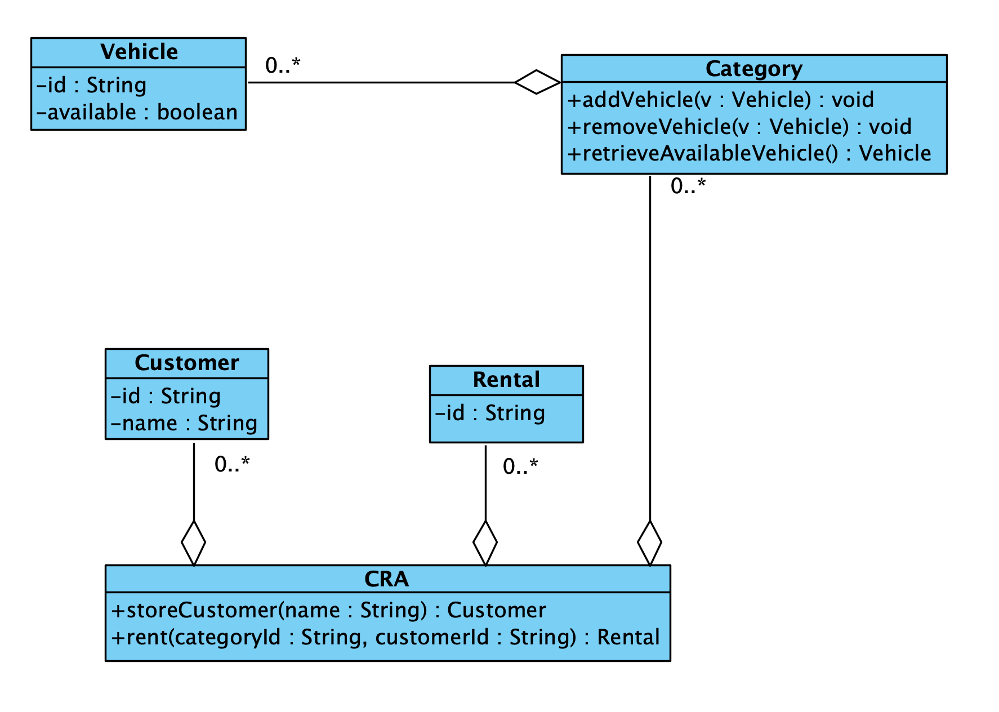

# Car Rental Agency

We have to implement a Car Rental Agency system. Here are a few things to consider:

1) Every vehicle needs to have a unique String id and for every vehicle we need to know, at any one point, whether it is rented or not.

2) All vehicles are grouped into categories (e.g. small, big, sports, van, etc). Every category has its own unique id and consists of the list of vehicles of the particular category. Make sure that vehicles can be added and removed from a category and that, when needed, we can also retrieve an available (not rented) vehicle for a given category.

3) The agency needs to store the following customer information: a unique String id and the name of each customer.

4) Any rental of a vehicle by a customer is recorded with a unique id of the form <customer_id:vehicle_id:date>.

5) Considering the above, the car rental agency system manipulates all customers, all (vehicle) categories, and all rentals (consider using maps for this: https://docs.oracle.com/javase/8/docs/api/java/util/Map.html, https://docs.oracle.com/javase/8/docs/api/java/util/HashMap.html).

The system also facilitates the rental of an available vehicle by a customer by specifying the desired category id and the customer id.

Draw a UML Class Diagram, which we can discuss before you start implementing the system!

## Identified nouns

#### Concepts
- Vehicle
- Category
- Customer
- Rental
- Car Rental Agency (CRA)

#### Attributes
- id of vehicle
- id of customer
- id of rental

- list of vehicles (category)
- available (vehicle)
- name of customer

## Identified relationships (all associations)

- add vehicle to category
- remove vehicle to category
- retrieve available vehicle from category
- CRA store customer
- CRA record rental
- CRA add/remove customer/vehicle/category/rental
- CRA rent vehicle category ID + customer ID

## Class Diagram

